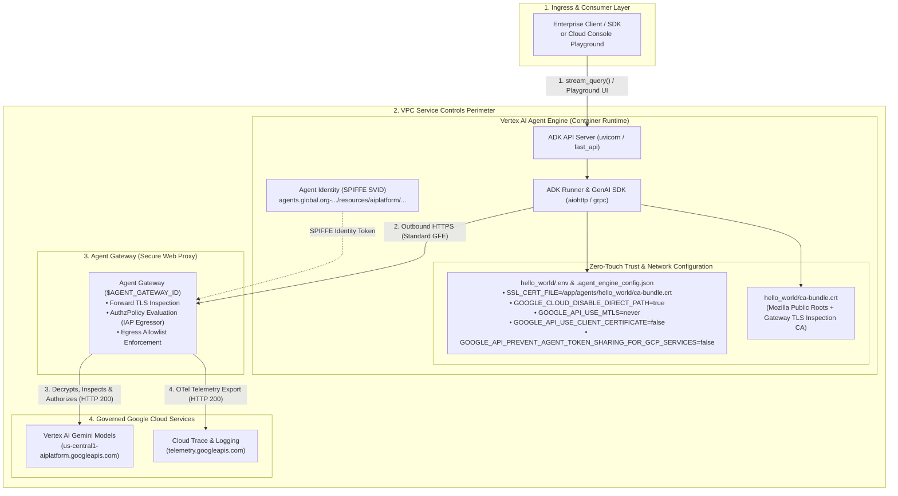

# Deploying Google ADK Agents with Agent Gateway in VPC Service Controls (VPC-SC)

This repository provides a production-ready template and zero-touch deployment pipeline for deploying **Google Agent Development Kit (ADK)** agents to **Vertex AI Agent Engine (Reasoning Engine)** integrated with **Google Cloud Agent Gateway** inside a **VPC Service Controls (VPC-SC)** perimeter.

---

## 1. Architecture Overview

When an ADK agent deployed on Vertex AI Agent Engine routes outbound egress through an **Agent Gateway** (`governedAccessPath: AGENT_TO_ANYWHERE`), the gateway acts as a managed **Secure Web Proxy (SWP)** performing **forward TLS inspection** and **Agent Identity (SPIFFE) authorization**.



---

## 2. Key Architectural Requirements for VPC-SC & Agent Gateway

Deploying containerized ADK agents (`sourceCodeSpec` via `adk deploy agent_engine`) behind an Agent Gateway in VPC-SC requires specific runtime and provisioning configurations that `deploy.py` automates out of the box:

### 2.1. Forward TLS Inspection Trust Store (`ca-bundle.crt`)
* **The Challenge:** When the Agent Gateway intercepts outbound HTTPS calls (e.g., to `us-central1-aiplatform.googleapis.com`), it re-signs the TLS certificate using an internal private Certificate Authority (`CN = Agent Gateway TLS Inspection CA`). While the Vertex AI container host injects this CA into the Linux system store (`/etc/ssl/certs/ca-certificates.crt`), Python HTTP libraries (`aiohttp`, `requests`, `certifi`) ignore the OS trust store by default and fail with `ssl.SSLCertVerificationError: [SSL: CERTIFICATE_VERIFY_FAILED]`.
* **Schema Pitfall Warning:** In the `networkservices/v1alpha1` API response for `agent-gateways describe`, the root certificate is nested under **`agentGatewayCard.rootCertificates`**. Using `--format=value(rootCertificates)` returns an empty string `""`, resulting in an empty CA bundle.
* **The Solution:** `deploy.py` fetches `--format=json` from `gcloud alpha network-services agent-gateways describe`, extracts `agentGatewayCard.rootCertificates`, verifies it is non-empty, combines it with `certifi`'s Mozilla root bundle into `hello_world/ca-bundle.crt`, and exports `SSL_CERT_FILE`, `REQUESTS_CA_BUNDLE`, and `GRPC_DEFAULT_SSL_ROOTS_FILE_PATH` pointing to `/app/agents/hello_world/ca-bundle.crt`.

### 2.2. Provisioning `AGENT_IDENTITY` at Resource Creation Time
* **The Challenge:** When `adk deploy agent_engine` is invoked without `--agent_engine_id` to create a brand-new Reasoning Engine, the ADK CLI calls `client.agent_engines.create()` with empty arguments (`config={}`). Vertex AI provisions the new instance with default `identity_type=SERVICE_ACCOUNT` (no SPIFFE SVID). Because `identity_type` cannot be converted from `SERVICE_ACCOUNT` to `AGENT_IDENTITY` during the subsequent `update()` call, outbound calls from the container through the Agent Gateway fail authorization.
* **The Solution:** When creating a new deployment, `deploy.py` first calls `client.agent_engines.create(config={"identity_type": "AGENT_IDENTITY", ...})` to provision the Reasoning Engine with SPIFFE Agent Identity (`agents.global.org-...`) from day one, and then passes `--agent_engine_id <NEW_ID>` to `adk deploy agent_engine`.

### 2.3. Suppressing mTLS Endpoint Redirection & Client Certificates
* **The Challenge:** Inside VPC-SC environments, workloads possess SPIFFE client certificates (`GOOGLE_API_CERTIFICATE_CONFIG`). By default, `google-auth` detects these certificates and redirects API traffic to `*.mtls.googleapis.com`. Because a forward TLS-inspecting proxy cannot terminate end-to-end client-certificate mTLS handshakes, requests fail with `403 Forbidden` or TLS handshake errors.
* **The Solution:** Export `GOOGLE_API_USE_MTLS=never`, `GOOGLE_API_USE_MTLS_ENDPOINT=never`, and `GOOGLE_API_USE_CLIENT_CERTIFICATE=false` so all SDK calls route over standard `googleapis.com` endpoints.

### 2.4. Enabling Agent Identity Token Sharing
* **The Challenge:** Vertex AI Agent Engine uses SPIFFE Agent Identity (`identity_type: AGENT_IDENTITY`). By default, token sharing restrictions can block the runtime from propagating its identity token to downstream Google Cloud services.
* **The Solution:** Export `GOOGLE_API_PREVENT_AGENT_TOKEN_SHARING_FOR_GCP_SERVICES=false` in both `.agent_engine_config.json` and `.env`.

### 2.5. Understanding `240.0.0.2:443` (PSC VIP / DirectPath) in Agent Gateway Logs
* When inspecting Agent Gateway request logs (`networkservices.googleapis.com/gateway_requests`), you may see `CONNECT 240.0.0.2:443` entries with `matchedRules: [{"name": "default_denied"}]`.
* **Why this occurs:** In Private Service Connect (PSC) environments, `240.0.0.2:443` is the internal PSC Virtual IP (VIP) for the outer `HTTP CONNECT` proxy tunnel when clients resolve Google APIs.
* **When it indicates an error vs. when it is benign:**
  * If `ca-bundle.crt` is missing the Gateway Root CA (or if `GOOGLE_API_PREVENT_AGENT_TOKEN_SHARING_FOR_GCP_SERVICES=false` is omitted), the client aborts the TLS handshake inside the tunnel, and the proxy logs `default_denied` against the outer `240.0.0.2:443` target.
  * When properly configured, actual model and session calls decrypt cleanly and log against the inner SNI hostname (`https://us-central1-aiplatform.googleapis.com/...`) with `status: 200`, `requestWasTlsIntercepted: true`, and `authzPolicyInfo.result: ALLOWED`.

---

## 3. Repository Structure

```text
.
├── deploy.py                           # Automated zero-touch deployment script
├── validate.py                         # End-to-end SDK & session validation script
├── requirements.txt                    # Deployment and runtime Python dependencies
├── README.md                           # Documentation & integration guide
└── hello_world/                        # ADK Agent package
    ├── __init__.py
    ├── agent.py                        # Root ADK Agent definition (gemini-2.5-flash)
    ├── .agent_engine_config.json       # Auto-generated Agent Engine & Gateway config
    ├── .env                            # Auto-generated runtime environment variables
    └── ca-bundle.crt                   # Auto-generated combined CA trust bundle
```

---

## 4. Prerequisites & Setup

1. **Clone the Repository:**
   ```bash
   git clone https://github.com/demichael4520/helloworld.git
   cd helloworld
   ```

2. **Authenticate with Google Cloud CLI:**
   ```bash
   gcloud auth login
   gcloud auth application-default login
   ```

3. **Create a Python Virtual Environment & Install Dependencies:**
   ```bash
   python3 -m venv .venv
   source .venv/bin/activate
   pip install -r requirements.txt
   ```

4. **Disable Interactive ADK CLI Telemetry Prompts:**
   The ADK CLI prompts for telemetry consent on first run, which can block automated deployments. Disable it once before deploying:
   ```bash
   adk telemetry disable
   ```

---

## 5. Deploying the Agent

The `deploy.py` script handles:
1. Extracting `agentGatewayCard.rootCertificates` from the Agent Gateway and building `hello_world/ca-bundle.crt`.
2. Generating a unified `hello_world/.agent_engine_config.json` and `hello_world/.env` with all 12 required VPC-SC and SSL environment variables without overwriting.
3. Provisioning a new Reasoning Engine with `identity_type=AGENT_IDENTITY` (if no cached ID exists in `.deploy_state.json` and `--update-id` is not passed).
4. Invoking `adk deploy agent_engine` and caching the deployed Reasoning Engine ID in `.deploy_state.json`.

### Configure Environment Variables
Set your target GCP project, region, and Agent Gateway name:
```bash
export PROJECT_ID="<YOUR_PROJECT_ID>"
export REGION="us-central1"
export AGENT_GATEWAY_ID="<YOUR_AGENT_GATEWAY_ID>"
```

### Option A: Deploy a New Instance (or Update Cached Instance)
On first run, this creates a brand-new `AGENT_IDENTITY` Reasoning Engine and saves its ID to `.deploy_state.json`. Subsequent runs automatically update the cached instance:
```bash
python deploy.py \
  --project "$PROJECT_ID" \
  --region "$REGION" \
  --gateway "$AGENT_GATEWAY_ID"
```

### Option B: Update a Specific Existing Reasoning Engine ID
To explicitly target an existing Reasoning Engine ID:
```bash
export REASONING_ENGINE_ID="<YOUR_REASONING_ENGINE_ID>"

python deploy.py \
  --project "$PROJECT_ID" \
  --region "$REGION" \
  --gateway "$AGENT_GATEWAY_ID" \
  --update-id "$REASONING_ENGINE_ID"
```

---

## 6. End-to-End Validation Guide

After deployment completes, validate the agent using both the Python SDK and Google Cloud Logging.

### Step 1: Run the End-to-End Validation Script (`validate.py`)
Run `validate.py` to test streaming queries against the deployed Reasoning Engine. By default, it automatically uses the Reasoning Engine ID saved in `.deploy_state.json`:
```bash
python validate.py \
  --project "$PROJECT_ID" \
  --region "$REGION"
```
*(Or pass `--engine-id "$REASONING_ENGINE_ID"` to validate a specific Reasoning Engine ID.)*

**Verified Output:**
```text
[*] Initializing Vertex AI Client (project=<YOUR_PROJECT_ID>, region=us-central1)...
[*] Connected to Reasoning Engine: projects/<YOUR_PROJECT_ID>/locations/us-central1/reasoningEngines/7840729018100875264
[*] Sending prompt: 'Hello! Please confirm you are responding through the Agent Gateway.'

[✓] Received Model Response (model: gemini-2.5-flash):
------------------------------------------------------------
Hello there! It's great to hear from you.

Yes, I can confirm that I am running as an agent within the Agent Gateway environment. How can I assist you today?
------------------------------------------------------------

[✓] End-to-end query validation PASSED!
```

### Step 2: Verify Agent Gateway Audit Logs in Cloud Logging
To confirm that outbound traffic from the Reasoning Engine was intercepted by the Agent Gateway, inspected via TLS, authorized by the `authzPolicy`, and returned **HTTP 200**, run the following query in **Google Cloud Logging** (Logs Explorer), replacing `<AGENT_GATEWAY_ID>` with your gateway name:

#### Cloud Logging Filter (Gateway Requests):
```text
resource.type="networkservices.googleapis.com/Gateway"
resource.labels.gateway_name="<AGENT_GATEWAY_ID>"
httpRequest.requestUrl:"aiplatform.googleapis.com"
httpRequest.status=200
```

**Verified Live Gateway Audit Log Entry (`HTTP 200` + TLS Intercepted + `ALLOWED`):**
```json
{
  "httpRequest": {
    "requestMethod": "POST",
    "requestUrl": "https://us-central1-aiplatform.googleapis.com/v1beta1/projects/<PROJECT_ID>/locations/us-central1/reasoningEngines/<REASONING_ENGINE_ID>/sessions",
    "status": 200,
    "latency": "0.337277s"
  },
  "jsonPayload": {
    "tlsSniHostname": "us-central1-aiplatform.googleapis.com",
    "enforcedGatewaySecurityPolicy": {
      "hostname": "us-central1-aiplatform.googleapis.com",
      "serverNameIndication": "us-central1-aiplatform.googleapis.com",
      "requestWasTlsIntercepted": true,
      "matchedRules": [
        {
          "action": "ALLOWED",
          "name": "default_denied"
        }
      ]
    },
    "authzPolicyInfo": {
      "result": "ALLOWED",
      "policies": [
        {
          "name": "projects/<PROJECT_NUMBER>/locations/us-central1/authzPolicies/<AUTHZ_POLICY_NAME>",
          "result": "ALLOWED"
        }
      ]
    }
  }
}
```

#### Cloud Logging Filter (Reasoning Engine Container Logs):
To inspect the internal stdout/stderr logs of the Reasoning Engine container:
```text
resource.type="aiplatform.googleapis.com/ReasoningEngine"
resource.labels.reasoning_engine_id="<REASONING_ENGINE_ID>"
```

---

## 7. Reference: Required Environment Variables

| Variable | Value | Purpose |
| :--- | :--- | :--- |
| `SSL_CERT_FILE` | `/app/agents/hello_world/ca-bundle.crt` | Instructs Python `ssl` and `aiohttp` to trust the Agent Gateway Private CA. |
| `REQUESTS_CA_BUNDLE` | `/app/agents/hello_world/ca-bundle.crt` | Instructs `requests` / `urllib3` (`google-auth`) to trust the Agent Gateway CA. |
| `GRPC_DEFAULT_SSL_ROOTS_FILE_PATH` | `/app/agents/hello_world/ca-bundle.crt` | Instructs gRPC C-Core (`opentelemetry`, `aiplatform`) to trust the Gateway CA. |
| `GOOGLE_CLOUD_DISABLE_DIRECT_PATH` | `true` | Signals Google Cloud runtimes to prefer standard GFE routing over DirectPath. |
| `GOOGLE_API_USE_MTLS` | `never` | Prevents client libraries from redirecting requests to `*.mtls.googleapis.com`. |
| `GOOGLE_API_USE_MTLS_ENDPOINT` | `never` | Companion flag preventing mTLS endpoint resolution overrides. |
| `GOOGLE_API_USE_CLIENT_CERTIFICATE` | `false` | Disables client-certificate presentation during TLS handshakes with the proxy. |
| `GOOGLE_API_PREVENT_AGENT_TOKEN_SHARING_FOR_GCP_SERVICES` | `false` | Allows Agent Identity (SPIFFE) tokens to authenticate to Vertex AI models. |
| `GOOGLE_CLOUD_PROJECT` | `<PROJECT_ID>` | Target GCP project ID for Vertex AI model invocation. |
| `GOOGLE_CLOUD_LOCATION` | `us-central1` | Target GCP region for Vertex AI endpoints. |
| `GOOGLE_GENAI_USE_VERTEXAI` | `1` | Routes GenAI SDK requests to Vertex AI rather than Google AI Studio. |
| `GOOGLE_CLOUD_AGENT_ENGINE_ENABLE_TELEMETRY` | `true` | Enables OpenTelemetry trace and log export to Cloud Logging / Trace. |
